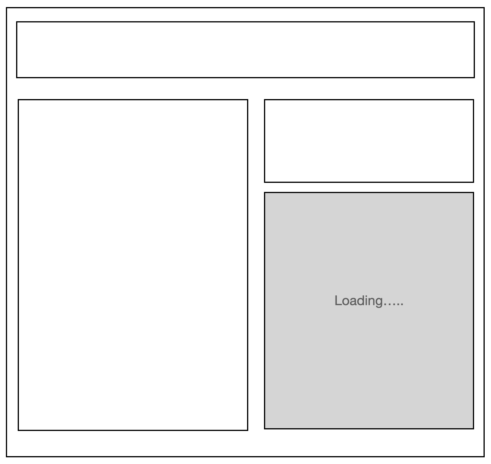
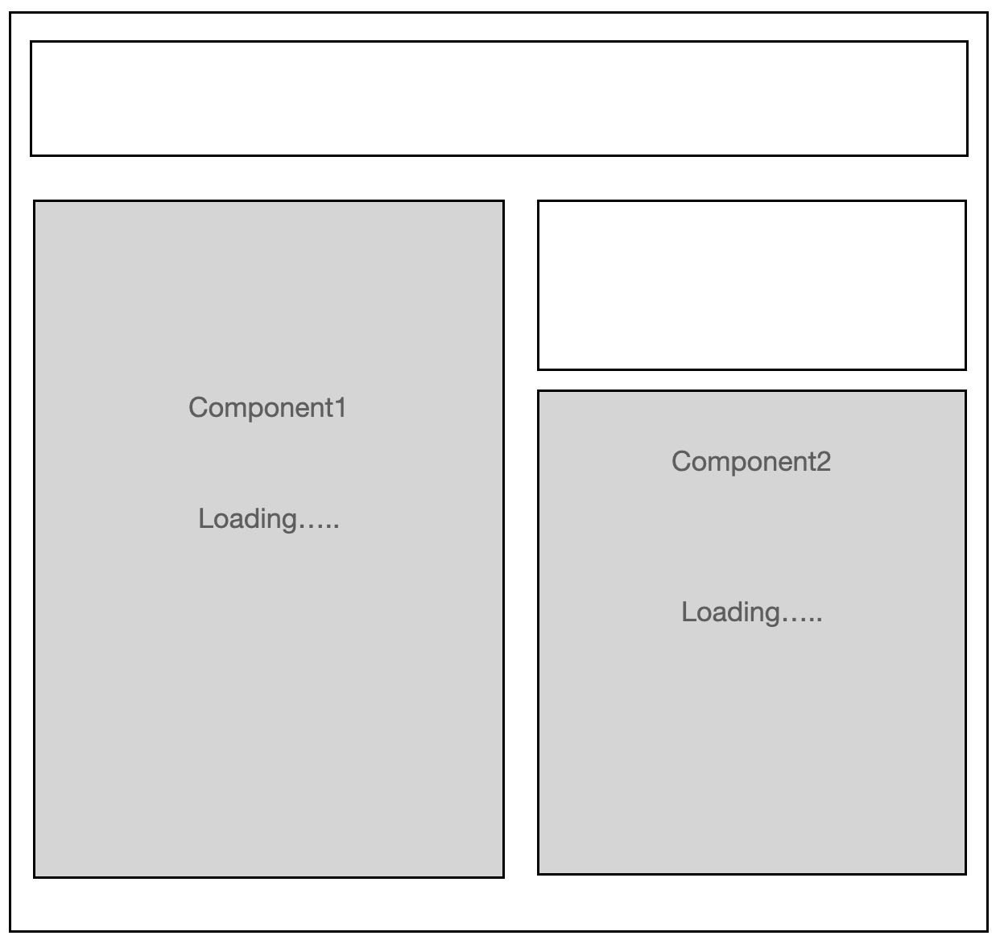

# React v18

- [Server Component](#Server-Component)

- [Automatic Batching](#Automatic-Batching(자동-배치))

- [Concurrent](#Concurrent(동시성)-기능)

- [Replacing render with createRoot](#Replacing-render-with-createRoot)

- [Suspense](#Suspense를-지원하는-새로운-서버사이드-렌더링-아키텍처)

## Server Component

- 어느 컴포넌트가 브라우저가 렌더링할 컴포넌트인지, 서버가 렌더링할 컴포넌트인지, 혹은 둘 중 하나가 렌더링할지를 미리 선택할 수 있다. 무거운 패키지에 의존하는 어플리케이션이 있다고 할 때, SSR에서 사용자는 코드와 해당 패키지를 다운로드해야 하는데 이 때 로딩 속도도 오래 걸리고 어플리케이션 용량도 커진다. Server Component로 변환하면 서버에서 컴포넌트의 렌더링을 수행하고 렌더링의 결과값만 사용자에게 스트리밍한다. 사용자는 JS를 다운로드 하지 않아도 된다.

- DB와 직접적인 커뮤니케이션 가능: 서버 컴포넌트에서 SQL 쿼리 수행 가능

- 파일명으로 서버, 클라이언트, 범용 컴포넌트 구분해서 사용 ( File.server.js, File.client.js, File.js)

## Automatic Batching(자동 배치)

#### Batching(배치)

- 리액트가 더 나은 성능을 위해 여러 개의 상태 업데이트를 한 번의 리렌더링으로 묶는 작업을 말한다.

~~~javascript
export default function Home() {
  const [count, setCount] = useState(0);
  
  console.log(count);

  const counter = () => {
    setCount(count + 1);
    setCount(count + 2);
    setCount(count + 3);
  }
   return (
    

      <button style={{ width: '100px', height: '50px'}}onClick={counter}>
      up  
      </button>
      <h1>{count}</h1>
    

  )
}
~~~

- 위의 예시에서 보면 setCount를 3번호출해서 상태를 업데이트 했지만 리액트에서는 배치를 수행하여 위 세 번의 상태업데이트를 한번의 리렌더링으로 처리한다. 하지만 리액트 v17이전에서는 이벤트 핸들러 내에서 실행되는 상태 업데이트가 아닌 경우 밑의 예시처럼 배치가 동작하지 않는다.
~~~javascript
const counter = () => {
  fetch().then(() => {
    // 내부의 경우 17이전버전에서는 동작하지 않음
  })
}
~~~

- 그렇지만 18버전부터는 자동배치(Automatic Batching)라는 것이 추가되었다. 그래서 일반적인 이벤트 핸들러 내부에서 상태 업데이트가 발생하지 않더라도 자동으로 배치를 적용해주는 것을 말한다.그리고 배치를 적용되길 원하지 않는경우에는 ReactDOM.flushSync 함수를 사용할 경우 리액트는 DOM을 즉시 없데이트 한다. (그 예로, 이제 setTimeout과 같은 비동기 함수들도 flushSync함수에 넣지 않으면 자동배치가 적용된다.)

## Concurrent(동시성) 기능

### 상태 업데이트

- 긴급 업데이트(Urgent updates): 직접적인 상호 작용 반영(타이핑, 오버, 스크롤링 등)

- 전환 업데이트(Transition Update): 하나의 뷰에서 다른 뷰로의 UI전환

React 17까지는 긴급, 전환으로 명시하는 방법 없이 모든 상태 업데이트는 긴급 업데이트이며 setTimeout, throttle, debounce 등의 기술을 이용해 긴급 업데이트 방해를 우회해왔었다.

하지만 React 18부터는 React.useTransition을 이용해서 전환 업데이트에 대응할 수 있다.

## Replacing render with createRoot
React v18은 root API두개가 있으며 ReactDom.createRoot를 사용하는걸 권장한다.
- Legacy root API: React 17이전버전은 ReactDOM.render로 동작했다.
- New root API: React v18부터 ReactDOM.createRoot로 동작한다. 그리고 createRoot API를 사용했을 때에 concurrent features를 사용할 수 있다.
### Root란?
React에서 root는 트리구조의 최상위계층이다.
- 기존에는 render 함수이다. LegacyAPI는 변수 container가 변경되지 않더라도 렌더링할 때 계속해서 container를 전달해야한다.
~~~javascript
import * as ReactDOM from 'react-dom';
import App from 'App';

const container = document.getElementById('app');

// Initial render.
ReactDOM.render(<App tab="home" />, container);

// During an update, React would access
// the root of the DOM element.
ReactDOM.render(<App tab="profile" />, container);
~~~
- 새로운 Root API이다. 이 경우에는 데이터 구조의 최상위 레벨에 있는 container를 전달하지 않아도 된다.
~~~javascript
import * as ReactDOM from 'react-dom';
import App from 'App';

const container = document.getElementById('app');

// Create a root.
const root = ReactDOM.createRoot(container);

// Initial render: Render an element to the root.
root.render(<App tab="home" />);

// During an update, there's no need to pass the container again.
root.render(<App tab="profile" />);
~~~
### Hydration
hydration API도 변경되었다. 
이전 버전:
~~~javascript
import * as ReactDOM from 'react-dom';
import App from 'App';

const container = document.getElementById('app');

// Render with hydration.
ReactDOM.hydrate(<App tab="home" />, container);
~~~
최신 버전:
~~~javascript
import * as ReactDOM from 'react-dom';

import App from 'App';

const container = document.getElementById('app');

// Create *and* render a root with hydration.
const root = ReactDOM.hydrateRoot(container, <App tab="home" />);
// Unlike with createRoot, you don't need a separate root.render() call here
~~~

## Suspense를 지원하는 새로운 서버사이드 렌더링 아키텍처

- HTML 스트리밍: 서버단에서 renderToString 대신 pipeToNodeWritable API를 사용하여 HTML을 스트리밍 할 수 있다.

- 선택적 Hydration: 앱에서 비용이 많이 드는 서브 컴포넌트 트리를 Suspense로 감싸서 전체 앱의 Hydration을 방해하지 않고 별도의 Hydration을 진행할 수 있다.

#### Example 1
- 이전 버전과는 달리 pipeToNodeWritable Api와 Suspense 두가지를 활용하면 서버사이드 렌더링을 완전히 다르게 구현할 수 있다. Data Fetching중인 컴포넌트 Suspense에 감싸져 있다고 가정하면 해당 컴포넌트를 제외하곤 모두 Hydration이 끝난 상태를 바로 브라우저에서 보여줄 수 있다. 밑의 그림에서 예시를 들면 loading중인 컴포넌트를 제외하곤 나머지 컴포넌트들은 전부 hydration이 끝나고 사용자가 상호작용할 수 있도록 준비된 상태이다. 즉, 전체 어플리케이션을 한번에 Hydration 할 필요가 없다. 그래서 성능이 낮은 기기라도  복잡한 렌더링을 거치는 컴포넌트가 포함된 브라우저를 볼때 해당 컴포넌트를 제외하고 먼저 다른 컴포넌트들은 Hydration을 마친 상태로 보여줄 수 있다는 것이다.

#### Example 2
- Data Fetching을 하고 있는 컴포넌트가 밑의 그림처럼 2개가 있고, Component1이 hydration이 진행이 되고 있는 상태라고 가정을 하자. 이때 사용자가 Component2에 이벤트를 동작 할려고 하면 현재 진행중이던 hydration을 잠시 중단하고 상호작용이 이루어지는 Conponent2의 hydration을 먼저 진행한다. 

